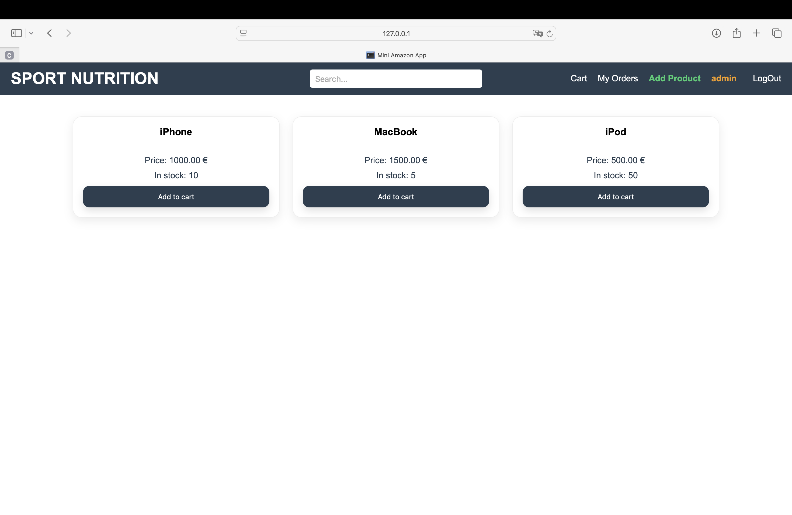
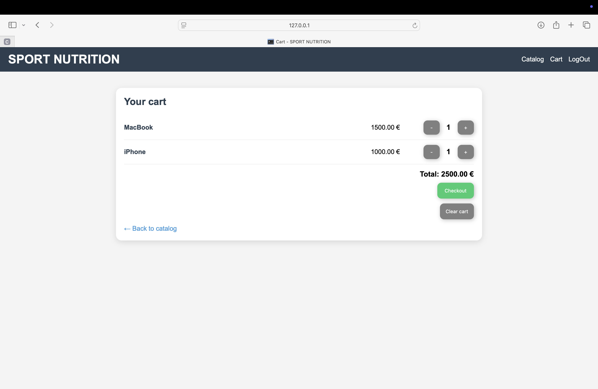
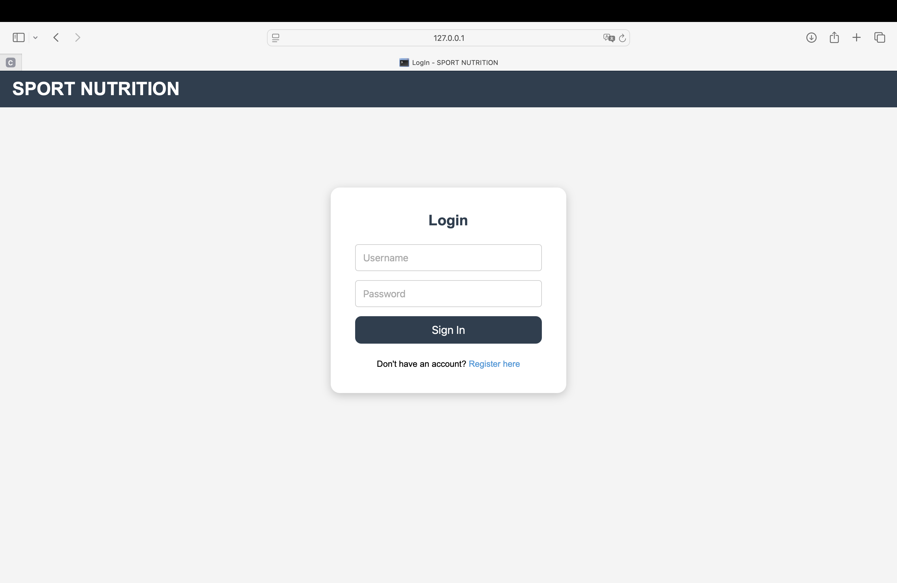

# Marketplace Website

A full-stack web marketplace built with Flask and SQLite. Supports user registration and authentication, product browsing with search, cart management, order checkout, and a dedicated admin panel for inventory control.

---

## Screenshots

<p align="center">
  
  
  
</p>
<p align="center">
  
  
</p>

---

## Features

- User registration and login with session management
- Product catalogue with search by name
- Shopping cart — add items, adjust quantity, clear cart
- Checkout with order processing and confirmation
- Order history per account with per-order item breakdown
- Admin account for adding products and managing stock levels

---

## Tech Stack

| Layer | Tools |
|---|---|
| Backend | Python, Flask |
| Frontend | HTML, Jinja2 templates |
| Database | SQLite |

---

## Database Schema

| Table | Description |
|---|---|
| `users` | Registered accounts |
| `products` | Product catalogue with name, price, and stock levels |
| `cart` | Per-user cart items linked to products |
| `orders` | Completed orders with totals and timestamps |
| `order_items` | Line items snapshot for each order |

---

## Getting Started

**Requirements:** Python 3, Flask

```bash
git clone https://github.com/Kirill-ark/Marketplace-website.git
cd Marketplace-website
pip install flask
python init_db.py
python app.py
```

Open `http://127.0.0.1:5000` in your browser.

To access the admin panel, log in with the `admin` account and navigate to `/add_product`.

---

## Project Structure

```
Marketplace-website/
├── templates/       # Jinja2 HTML templates
├── app.py           # Flask routes and business logic
├── init_db.py       # Database schema and initialization
└── main.py
```
